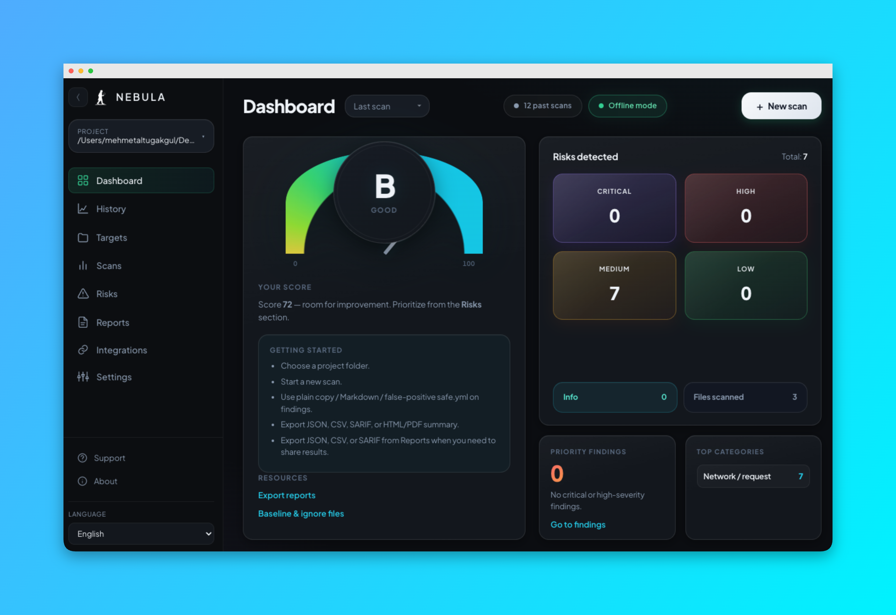

# N E B U L A

**N E B U L A** is a desktop security scanner for local source code and project metadata. Performs **offline-first** analysis (with optional online **npm audit**), and presents findings in a structured UI with exports suitable for teams and CI-style workflows.

This document is a **handbook**: it explains what the tool does, how to configure it, and how each feature fits together.



---

## Table of contents

1. [What N E B U L A scans](#what-nebula-scans)
2. [Requirements](#requirements)
3. [Installation & running](#installation--running)
4. [Building distributables](#building-distributables)
5. [Quick start](#quick-start)
6. [User interface tour](#user-interface-tour)
7. [Scan pipeline (phases)](#scan-pipeline-phases)
8. [Findings: categories & severities](#findings-categories--severities)
9. [Health score](#health-score)
10. [Project configuration: `.security-checker.yml`](#project-configuration-security-checkeryml)
11. [Ignoring paths: `.security-checker-ignore`](#ignoring-paths-security-checker-ignore)
12. [False positives: `.security-checker-safe.yml`](#false-positives-security-checker-safeyml)
13. [Baseline: `.security-checker-baseline.json`](#baseline-security-checker-baselinejson)
14. [Custom rules: YAML](#custom-rules-yaml)
15. [Optional: OSV npm data](#optional-osv-npm-data)
16. [Optional: known-bad file hashes](#optional-known-bad-file-hashes)
17. [Optional: online npm audit](#optional-online-npm-audit)
18. [Exports & reports](#exports--reports)
19. [Application settings](#application-settings)
20. [Internationalization (TR / EN)](#internationalization-tr--en)
21. [Keyboard shortcuts](#keyboard-shortcuts)
22. [Privacy & network](#privacy--network)
23. [For developers](#for-developers)
24. [License](#license)

---

## What N E B U L A scans

N E B U L A walks a **project root** you select, respects **`.gitignore`** (when present), skips common build/vendor directories, and analyzes **textual** source and config files up to a configurable size limit (default **2 MiB** per file).

High-level capabilities include:

| Area | Examples |
|------|----------|
| **Secrets & credentials** | Regex-based detection of keys, tokens, connection strings, suspicious filenames (`.env`, PEM, service account JSON, etc.) |
| **Network & risky APIs** | URLs, `fetch`, `axios`, sockets, DNS, WebSockets |
| **Dangerous patterns** | `eval`, `new Function`, dynamic `require`, `child_process`, `vm` (regex + **AST** where enabled) |
| **Dependencies** | `package.json` / lockfile heuristics, optional **offline** npm advisory data, optional **ecosystem** checks |
| **Manifests** | Basic checks on common manifest files |
| **Custom rules** | Project-defined regex rules in YAML |
| **Hashes** | Optional blocklist of SHA-256 digests for known-bad files |
| **Git blame hints** | Optional enrichment for selected severities (configurable) |

The exact set of phases and options depends on [project configuration](#project-configuration-security-checkeryml) and [application settings](#application-settings).

---

## Requirements

- **Node.js** (LTS recommended) for development and scripts  
- **npm** (or compatible) for dependencies  
- **Electron** (pulled in as a dev dependency for running and packaging)

---

## Installation & running

From the repository root:

```bash
npm install
npm start
```

This launches the Electron shell and loads the renderer UI.

---

## Building distributables

Uses **electron-builder** (see `package.json` → `build`):

```bash
npm run pack    # unpacked directory under dist/
npm run dist    # platform installers / bundles per electron-builder config
```

Bundled resources (e.g. offline advisory data under `data/`) are included per the `build` configuration.

---

## Quick start

1. Start the app (`npm start`).
2. **Select a project folder** (your repository root).
3. Click **New scan** (or use the keyboard shortcut).
4. Review the **dashboard** (health gauge, risk summary, priority hints).
5. Open **Findings** to filter by category/severity, search, copy as plain text or **Markdown**, or mark **false positives** (writes [safe suppressions](#false-positives-security-checker-safeyml)).
6. Use **Reports** to export **JSON**, **CSV**, **SARIF**, or summary **HTML / PDF** as needed.

For repeatable behavior across machines, add a [`.security-checker.yml`](#project-configuration-security-checkeryml) to the repo and commit [ignore](#ignoring-paths-security-checker-ignore) / [safe](#false-positives-security-checker-safeyml) files as team policy allows.

---

## User interface tour

### Dashboard

- **Health gauge**: 0–100 style score derived from finding severities (see [Health score](#health-score)).
- **Risk summary**: counts by severity plus info / files scanned.
- **Priority & categories**: quick links into findings.
- **Tips & resources**: onboarding hints and navigation to reports / target configuration.

### Findings

- Filter by **category** and **severity**, full-text **search**.
- Per finding: open file in editor (OS integration), **Copy**, **Markdown** (for issues/PRs), **False positive (safe)**.
- **Virtualized list** option for very large result sets (Settings).
- **Locale-aware titles/explanations** when the scanner attaches i18n keys (see [Internationalization](#internationalization-tr--en)).

### Targets / project

- Surfaces paths, ignore hints, and links relevant to the selected root.

### Scans / history / trend

- Recent scan metadata and simple trend visualization where enabled.

### Reports

- Export last scan results as **JSON**, **CSV**, **SARIF**.
- **HTML / PDF** summary export.
- **Baseline** writing: stores hashed keys of current findings to hide them on subsequent scans when “compare to baseline” is enabled.

### Settings

- Scan toggles (AST, heuristics, advisories, npm audit, node_modules shallow scan, baseline compare).
- **Ignore globs** (app-level; in addition to project ignore file).
- **Mute** categories/severities in the UI.
- **Virtual list**, infinite scroll, **high contrast** theme.
- **Locale** (Turkish / English) and optional **update check** URL.
- **Editor command template** (where supported) for opening files at a line.

### About / support

- Version, changelog pointer, external links (opened safely via the main process where implemented).

---

## Scan pipeline (phases)

A typical scan progresses through phases such as:

1. **Dependencies** — `package.json`, `package-lock.json`, Python/Go/Rust lockfiles where present.
2. **Manifests** — additional manifest-oriented checks.
3. **Offline advisories** — bundled/minimal npm advisory data (if enabled).
4. **Ecosystem advisories** — additional offline ecosystem signals (if enabled).
5. **OSV npm** — if `osv.npmJsonl` is configured in `.security-checker.yml`.
6. **npm audit** — only if **optional npm audit** is enabled (network).
7. **Shallow `node_modules`** — optional top-level `package.json` pass under `node_modules`.
8. **File walk** — builds file list with ignore rules, size limits, gitignore.
9. **Per-file** — content regex patterns, custom rules, optional AST scan, heuristics, bad hashes, git blame hints.

Progress events are throttled for UI responsiveness (especially file counts).

---

## Findings: categories & severities

**Severities** include (ordered by typical priority): `critical`, `high`, `medium`, `low`, `info`.

**Categories** include (non-exhaustive): `credential`, `network`, `dangerous`, `dependency`, `filename`, `advisory`, `manifest`, `heuristic`, `ast`, `rule`, `hash`, and others as emitted by scanners.

Each finding generally includes: `title`, optional `why`, optional `detail`, `file`, optional `line`, optional `snippet`, optional `patternId`, and optional i18n keys for localized UI text.

---

## Health score

The dashboard **health score** (0–100) is a **heuristic summary**, not a formal certification. It penalizes findings by severity (critical/high weighted more than info). An empty scan with no issues tends toward **100**; many severe issues drive the score down.

Use it as a **trend and triage** signal alongside raw finding counts and exports.

---

## Project configuration: `.security-checker.yml`

Place **`.security-checker.yml`** or **`.security-checker.yaml`** in the **project root**. It is merged with built-in defaults and app overrides.

### Top-level keys (reference)

| Key | Purpose |
|-----|---------|
| `version` | Documented convention; use `1` for clarity. |
| `profile` | Name of an entry under `profiles` to apply. |
| `profiles` | Named bundles of `scan` / mute options (e.g. `next`, `electron`). |
| `scan` | Scan options merged into the engine (see below). |
| `osv.npmJsonl` | Path to OSV npm JSONL for enriched dependency CVE-style signals. |
| `customRulesFile` | Path to custom YAML rules file. |
| `safeSuppressionsFile` | Path to safe-suppressions YAML (default app button still writes `.security-checker-safe.yml` in root unless you align paths manually). |
| `badHashesFile` | Path to newline-separated SHA-256 hashes. |
| `gitBlame` | `{ enabled, severities }` for blame hints on selected severities. |
| `fileConcurrency` | Parallel file tasks cap (bounded internally, e.g. up to 32). |

### Common `scan` options

| Option | Typical meaning |
|--------|-----------------|
| `maxFileBytes` | Max bytes read per file for content scan. |
| `enableAstScan` | Parse JS/TS with Babel AST for structural findings. |
| `enableHeuristics` | Additional heuristic findings. |
| `enableOfflineAdvisories` | Use bundled offline npm advisory data. |
| `enableEcosystemAdvisories` | Ecosystem-oriented offline checks. |
| `optionalNpmAudit` | Usually controlled from UI; project file can align team defaults. |
| `scanNodeModulesPackageJson` | Shallow scan under `node_modules`. |
| `compareToBaseline` | Hide findings matching baseline keys. |
| `extraIgnoreGlobs` | Additional glob patterns (same spirit as ignore file). |
| `muteCategories` / `muteSeverities` | Suppress categories/severities at scan level. |

Copy **`.security-checker.example.yml`** from this repo as a starting point.

### Example templates

Under `examples/config-templates/`:

- `next.yml` — Next.js-oriented ignores (`/.next`, `/out`, etc.).
- `electron.yml` — Electron-oriented notes.
- `monorepo.yml` — Monorepo-oriented hints.

These are **starting points**: adapt paths and profiles to your repository.

---

## Ignoring paths: `.security-checker-ignore`

Create **`.security-checker-ignore`** in the project root. Each non-empty, non-comment line is a **glob-like** pattern (similar usage to typical ignore files).

Use it to skip secrets-heavy or huge trees, e.g.:

```text
**/.env*
**/*.log
**/dist/**
```

Patterns are combined with any `extraIgnoreGlobs` from config and the app settings.

---

## False positives: `.security-checker-safe.yml`

When you click **False positive (safe)** in the UI, the app appends a rule to **`.security-checker-safe.yml`** in the project root (unless you only use a custom `safeSuppressionsFile` path—in that case, manage that file directly).

### File shape

```yaml
suppress:
  - fileGlob: "**/src/some-file.js"
    category: dangerous
    patternId: some-pattern-id
    titleContains: "substring of finding title"
```

A finding is suppressed only if **every** specified field on a rule matches (file glob, optional `patternId`, optional `category`, optional `titleContains`).

**Tips**

- Prefer **narrow** rules (`patternId` + `fileGlob`) over broad `titleContains`.
- Suppressions apply on the **next scan**; the current list is not live-edited in the UI.
- Edit or delete rules manually in YAML as needed.

See `.security-checker/safe.example.yml` for samples.

---

## Baseline: `.security-checker-baseline.json`

**Baseline** stores stable keys for “known accepted” findings. When **compare to baseline** is enabled, matching findings are filtered out of the **main** report (baseline is applied during scan finalization).

Use baselines for:

- Legacy debt you acknowledge but cannot fix immediately.
- Noise that is reviewed and accepted under change control.

The baseline file is JSON and managed through the **Reports** UI when you write a baseline from the current results.

---

## Custom rules: YAML

Point `customRulesFile` to a YAML file containing a `rules` array. Each rule can include:

- `id` — stable identifier (used in SARIF / tooling).
- `title` — short description.
- `severity` — e.g. `low`, `medium`, `high`.
- `regex` — pattern applied to file content.
- `extensions` — allowed file extensions.
- `why` — rationale (shown when surfaced as a finding).

Example: `.security-checker/rules.example.yml`.

---

## Optional: OSV npm data

For richer npm vulnerability matching from lockfiles:

1. Use the provided scripts (see `package.json`):  
   `npm run fetch:osv` / `npm run fetch:osv:extract`  
   or run `node scripts/download-osv-npm.mjs --help`.
2. Set `osv.npmJsonl` in `.security-checker.yml` to the extracted **JSONL** path.

This is **offline data** once downloaded; it does not replace a full registry audit but improves coverage beyond the minimal bundled advisory set.

---

## Optional: known-bad file hashes

Provide a text file of **SHA-256** hex digests (one per line, comments with `#` if your workflow allows). Reference it via `badHashesFile` in `.security-checker.yml`. Files whose content hashes match are flagged.

Example template: `data/bad-sha256.example.txt`.

---

## Optional: online npm audit

When enabled in the UI (and network is available), N E B U L A can run **`npm audit --json`** in the project root and map results into findings. This:

- Requires **network** access and respects the machine’s npm/proxy configuration.
- Produces **dynamic titles** from npm (often English) while localized “why” text may be provided via i18n where wired.

Use offline advisories + OSV for air-gapped or policy-restricted environments.

---

## Exports & reports

| Format | Use case |
|--------|----------|
| **JSON** | Full structured report for automation or archival. |
| **CSV** | Spreadsheets, quick filtering. |
| **SARIF** | CI integration, GitHub Advanced Security–style consumers (verify compatibility with your platform). |
| **HTML / PDF summary** | Human-readable executive summaries. |

SARIF includes tool name/version from `package.json` (`productName` / `version`).

---

## Application settings

Stored under the OS user data path as **`checker-settings.json`** (see `settingsStore.js`). Defaults include:

- **2 MiB** `maxFileBytes`, AST/heuristics/advisories on, npm audit off by default.
- **Locale** default `tr` (Turkish); switch to `en` in UI.
- **Worker thread** scanning enabled by default for UI responsiveness.
- **Virtual list** off by default (enable for very large finding lists).

Settings persist per user profile on the machine, independent of the scanned repository.

---

## Internationalization (TR / EN)

The UI strings use **`src/renderer/i18n.js`**. Finding titles and explanations that support localization use **`titleKey` / `whyKey` / `detailKey` / `detailLineKey`** merged from **`src/renderer/finding-i18n.js`** at runtime.

If a finding has no keys, raw scanner text (often Turkish) is shown—over time, more modules gain keys. Pattern, AST, filename, and some dependency findings are covered; extend `finding-i18n.js` and scanner payloads consistently when adding new keyed findings.

---

## Keyboard shortcuts

(Exact labels are localized in the **Shortcuts** modal.)

| Shortcut | Action |
|----------|--------|
| **Ctrl/Cmd + N** | New scan |
| **Ctrl/Cmd + K** | Focus search |
| **?** | Open shortcuts help |
| **Esc** | Close modal |

---

## Privacy & network

- **Core scanning** is **local**: file read, parsing, regex, AST, offline data.
- **No telemetry** is described in this codebase path by default; optional **update check** only runs if you configure a releases URL and opt in.
- **npm audit** and **OSV download scripts** use the network when you explicitly use those features.

---

## License

**MIT** — see `package.json` and repository `LICENSE` if present.

---

## Summary

N E B U L A is a **practical, local-first code security assistant**: configure it per repo with **`.security-checker.yml`**, tame noise with **ignore** and **safe** files, track debt with **baseline**, and share results via **SARIF/CSV/JSON** or summaries. Treat the **health score** as a guide, not a guarantee—and always review findings in context.
